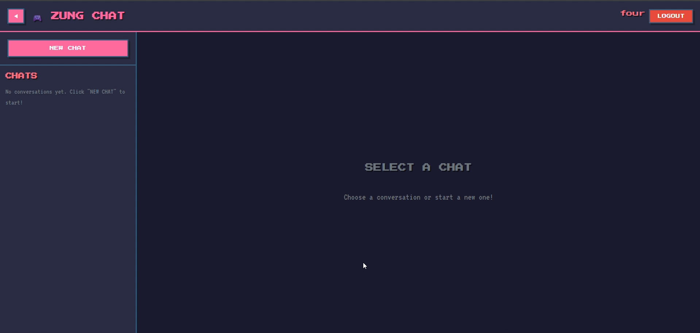

# 💬 Zung Chat App

<p align="center">
  
</p>

<p align="center">
  A modern, real-time chat application built with the MERN stack for the community 🚀
</p>

<p align="center">
  <a href="https://hackclub.com" target="_blank">
    
  </a>
  <a href="https://zung-chat.vercel.app" target="_blank">
    
  </a>
</p>

---

## ✨ About the Project

**Zung Chat App** is a modern, real-time chat application built with the MERN stack and Socket.IO.  
This open-source project provides a complete full-stack chat experience with user authentication, real-time messaging, and a beautiful retro-inspired UI.

This project is built **for Hack Club** and the open-source community, focusing on:
- Real-time communication
- Modern tech stack implementation
- Clean and maintainable code
- Community-driven development

---

## 🎯 Features

- 🔐 **User Authentication** – Secure login/register with JWT
- 💬 **Real-time Messaging** – Instant chat with Socket.IO
- 👥 **User Management** – View online users and chat history
- 🎮 **Retro UI** – NES.css inspired interface
- 📱 **Fully Responsive** – Works seamlessly on all devices
- 🌙 **Modern Design** – Built with React and TailwindCSS
- ⚡ **Fast & Lightweight** – Optimized performance
- 🔒 **Secure** – Bcrypt password hashing

---

## 🛠️ Tech Stack

### Frontend (Client)
- **React 19** – UI library with latest features
- **Vite** – Lightning-fast build tool
- **TailwindCSS 4** – Utility-first CSS framework
- **Redux Toolkit** – State management
- **React Router DOM** – Client-side routing
- **Socket.IO Client** – Real-time communication
- **Framer Motion** – Smooth animations
- **NES.css** – Retro styling framework
- **React Hook Form** – Form validation
- **Axios** – HTTP client

### Backend (Server)
- **Node.js** – JavaScript runtime
- **Express 5** – Web application framework
- **MongoDB** – NoSQL database
- **Mongoose** – MongoDB object modeling
- **Socket.IO** – Real-time bidirectional communication
- **JWT** – Secure authentication
- **Bcrypt** – Password hashing
- **CORS** – Cross-origin resource sharing

---

## 🚀 Getting Started

### Prerequisites
- Node.js (v16 or higher)
- MongoDB (local or Atlas)
- npm or yarn

### Installation

1. **Clone the repository**
   ```bash
   git clone https://github.com/yourusername/zung-chat-app.git
   cd zung-chat-app
   ```

2. **Setup Backend**
   ```bash
   cd server
   npm install
   ```
   
   Create a `.env` file in the `server` directory:
   ```env
   MONGO_URI=your_mongodb_connection_string
   JWT_SECRET=your_jwt_secret_key
   PORT=5000
   ```
   
   Start the server:
   ```bash
   npm start
   ```

3. **Setup Frontend**
   ```bash
   cd ../client
   npm install
   ```
   
   Create a `.env` file in the `client` directory:
   ```env
   VITE_API_URL=http://localhost:5000
   ```
   
   Start the development server:
   ```bash
   npm run dev
   ```

4. **Open your browser**
   - Frontend: `http://localhost:5173`
   - Backend: `http://localhost:5000`

---

## 🌐 Deployment Status

- ✅ **Frontend**: Deployed on [Vercel](https://zung-chat.vercel.app)
- ⚠️ **Backend**: Not deployed yet – runs locally only

> **Note**: To use the live demo, you'll need to run the backend server locally and update the frontend API URL.

---

## 📂 Project Structure

```
zung-chat-app/
├── client/          # React frontend
│   ├── src/
│   ├── public/
│   └── package.json
├── server/          # Express backend
│   ├── src/
│   ├── server.js
│   └── package.json
└── README.md
```

---

## 🤝 Contributing

This is an **open-source project** and contributions are welcome! 

1. Fork the repository
2. Create your feature branch (`git checkout -b feature/AmazingFeature`)
3. Commit your changes (`git commit -m 'Add some AmazingFeature'`)
4. Push to the branch (`git push origin feature/AmazingFeature`)
5. Open a Pull Request

---

## 📝 License

This project is open source and available for the community.

---

## 💖 Acknowledgments

Built with ❤️ for [Hack Club](https://hackclub.com) and the open-source community.

---
